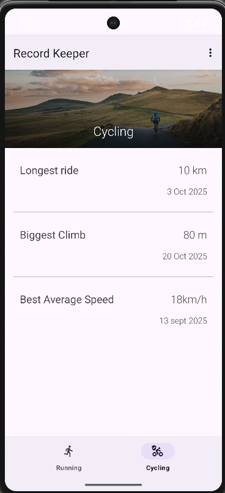
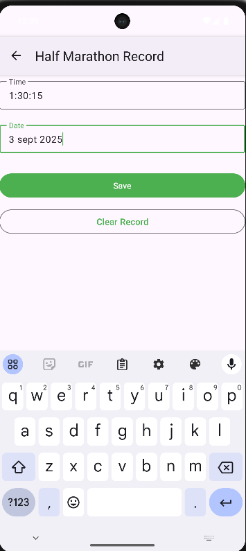

# RecordKeeper App  

A simple and intuitive Android app to keep track of your **Running** and **Cycling** records.  
Built with **Kotlin**, **Fragments**, and **ViewBinding**.  

---

## 📱 Features  

- **Running Records**  
  - Track personal bests for **5K**, **10K**, **Half Marathon**, and **Marathon**.  
  - Displays best time and date for each category.  

- **Cycling Records**  
  - Track **Longest Ride**, **Best Speed**, and **Biggest Climb**.  
  - Edit or clear records anytime.  

- **Editable Records**  
  - Tap on any record to update details via a dedicated edit screen.  
  - Save or delete individual records easily.  

- **Clear Records**  
  - Option to clear all **Running records**, all **Cycling records**, or **both** in one tap.  
  - Provides a quick reset without reinstalling the app.  

- **Navigation**  
  - BottomNavigationView to switch between **Running** and **Cycling** sections.  
  - Clean and scrollable layouts optimized for different devices.  

---

## 🛠️ Tech Stack  
- **Kotlin**  
- **Android Fragments**  
- **ViewBinding**  
- **SharedPreferences** (for storing records)  
- **Material Components** (UI design)  

---

## 📸 Screenshots  


<table>
  <tr>
    <th>running</th>
    <th>cycling</th>
    <th>editrecord</th>
  </tr>
  <tr>
    <td></td>
    <td></td>
    <td></td>
  </tr>
</table>
---

## 🚀 Getting Started  

1. Clone the repository:  
   ```bash
   git clone https://github.com/Notshreyasrbhat/Record_Keeping_App

2. Open in **Android Studio**.

3. Build & run the app on an emulator or real device.

---

## ✅ Future Improvements

* Add support for **cloud sync** across devices.
* Add **charts & progress tracking**.
* Export/import records feature.

---

## 📄 License

This project is licensed under the MIT License.
